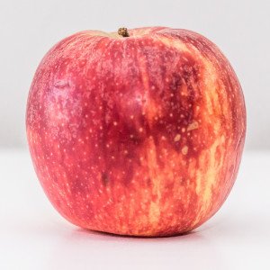
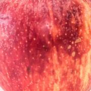
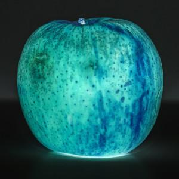
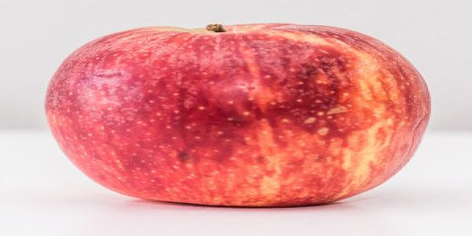
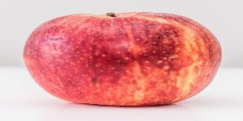
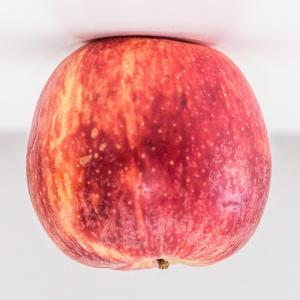
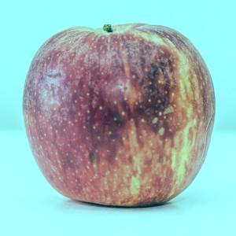
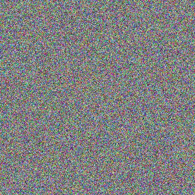
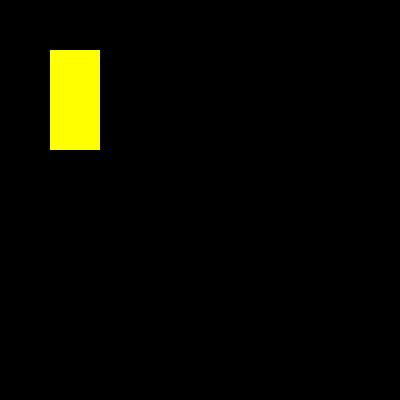
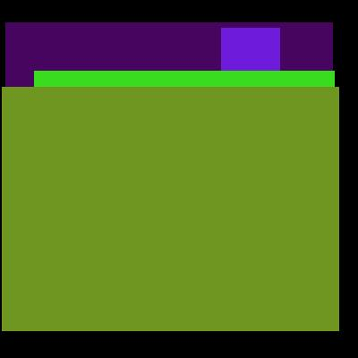

# Image-Manipulation-Project

In this project,using 2D arrays to:

## Modify images
- stretching the image horizontally
- shrinking the image vertically 
- negating the color
- applying a color filter
- inverting the image 

## Create new images
- creating an image consisting of random pixels
- placing a rectangle in the image
- using the method to randomly place many rectangles in the image

## Preknowledge: how images work in Java:

- Images consist of pixels which are the individual points in the image containing some color. 
- Each pixel has some red, green, blue, and alpha value which represents the amount of each of those colors in the pixel. The red, green, and blue values can be mixed to create all of the visible colors on your screen. The alpha value represents the transparency of the pixel (or how close the color of the pixel is to the background color of the image). 
- A higher resolution image means that there are more pixels contained within it.

- a loaded image is stored into a `BufferedImage` object. From this object, we can extract each pixel value and store it into a 2D array which we can manipulate.
- The pixel values are stored as ints because each pixel value in the BufferedImage object is represented by a hexadecimal value which contains the red, green, blue, and alpha components. The maximum value of any of the RGBA values is 255 and the minimum is 0. 
- There are some methods provided for you in this project which handle the conversion between images and 2D arrays as well as extracting the R, G, B, and A values from a pixel. You will only need to implement methods which work with the 2D arrays.

# Result 
- 
- 
- 
- 
- 
- 
- 
- 
- 
- 

